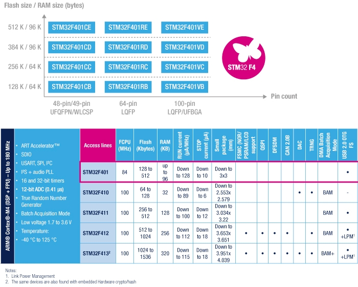

# [STM32F401](https://github.com/sochub/STM32F401) 
 
#### 父级：[STM32F4](https://github.com/sochub/STM32F4)
#### 内核：[Cortex M4](https://github.com/sochub/CM4) 
#### 收录芯片定级：[Level](https://github.com/sochub/Level)
### [芯片简介](https://github.com/sochub/STM32F401/wiki)

[STM32F401](https://github.com/sochub/STM32F401) 提供了动态功耗（运行模式）和处理性能之间的最佳平衡，同时在3 x 3 mm的小封装内集成了大量的增值特性。

工作频率为84 MHz的Cortex®-M4内核（具有浮点单元）的性能，同时还能在运行和停机模式下实现出色的低功耗性能。

 

### 关键特性

#### USB OTG + SDIO

* STM32F401产品组合具有128至512 KB的Flash存储器和96 KB的SRAM。 封装为49-100引脚
* 3路USART速度高达10.5 Mbit/s，4路SPI速度高达42 Mbit/s
* 3路I²C，2个全双工I²S，最高32-bit/192KHz，
* 1路SDIO
* 1个全速USB 2.0 OTG
* 速度高达2.4 MSPS的12位ADC
* 10个定时器，频率高达84 MHz的16和32位定时器

### [收录资源](https://github.com/sochub/STM32F401)

* [参考文档](docs/)
* [参考资源](src/)

### [关联资源](https://github.com/sochub)

* [编译工具](https://github.com/sochub/arm-none-eabi)

### [选型建议](https://github.com/sochub)

[STM32F401](https://github.com/sochub/STM32F401)是[STM32F4](https://github.com/sochub/STM32F4)系列中的低端版本，可以作为F4系列中降成本迁移的首选

* 向下替换方案 [STM32F103](https://github.com/sochub/STM32F103) 
* 相近替换方案 [STM32F401](https://github.com/sochub/STM32F401) 

##  [SoC资源平台](http://www.qitas.cn)
